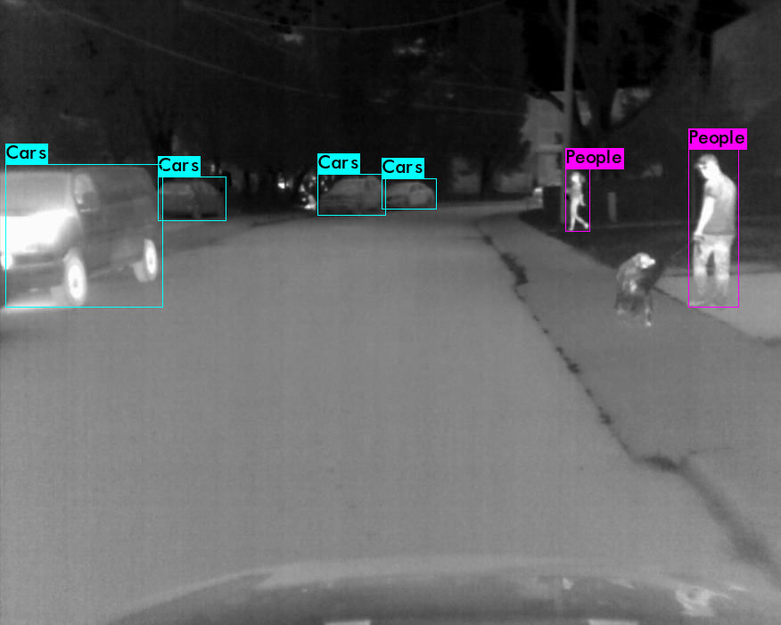
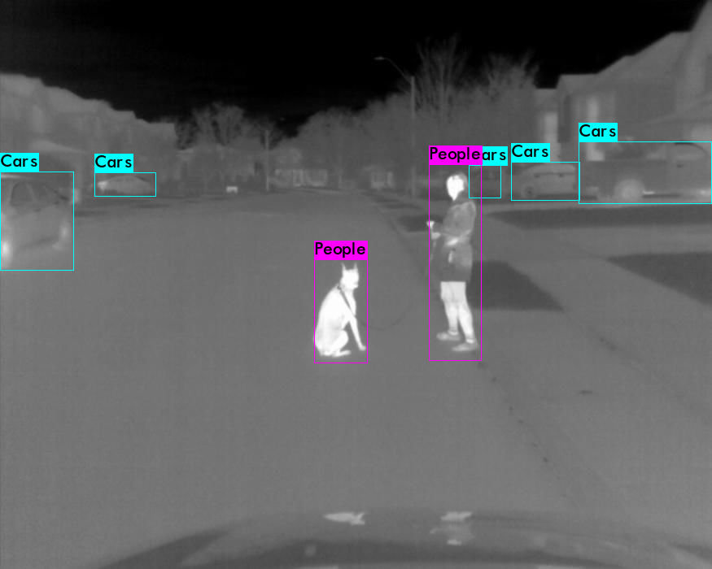

# An Dog Expansion Pack for The FREE FLIR Thermal Dataset
This expansion pack is prepared specifically for training a YOU-ONLY-LOOK-ONCE(YOLO) network. All frames are labeled in the YOLO format.
If you want to use this expansion pack for other purposes, images are still available for download but requires manual labeling.

The **FREE FLIR Thermal Dataset for Algorithm Training** can be downloaded [here](https://www.flir.ca/oem/adas/adas-dataset-form/).

The YOLO format has the shape of  
**0 0.477734 0.545833 0.077344 0.175000** 
* The first integer **0** represents the object class.
* The float numbers represent x, y, width, and height. 

A detailed description of the YOLO format can be found [here](https://github.com/AlexeyAB/Yolo_mark/issues/60).

FLIR's dataset includes 240 **Dog** bounding boxes. Solely use FLIR's dataset to train a learning algorithm usually yields poor mAP on the dog class. 
The following are the results from training a YOU-ONLY-LOOK-ONCE(YOLOv4) network using FLIR's dataset.

mAP@IoU=50 for **Dog** is 0.00%. 

mAP@IoU=75 for **Dog** is 0.00%. 

The bounding boxes generated are

The dogs are either missed or misclassified.

**The Highlights of This Expansion Pack** 
* Added in 3,054 more **DOG** frames captured by a **FLIR A65 IR Temperature Sensor**.
* All frames are in `.jpeg` format making it consistent with the original FLIR dataset.
* The frames in this expansion pack started with the name`FLIR_08863.jpeg`. As the original FLIR dataset ended with `FLIR_08862.jpeg`, you can directly copy and paste all the frames in this expansion pack to the FLIR directory.
* All frames are 24-bit color images.

